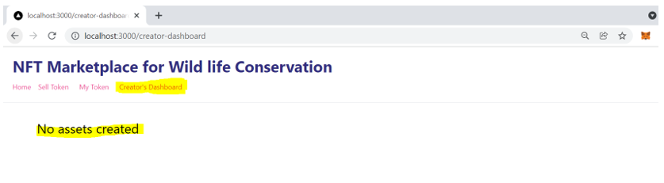

# blockchain-developer-bootcamp-final-project

This project is inspired by the POC I presented in my organiazation as part of Hackathon. The idea is to create an NFT Marketplace for wildlife conservation groups.

#Problem statement:
Wildlife on planet Earth is under siege from all sides, facing down habitat loss and the impact of climate change. Currently there are more than 38000 species at risk of extinction.
Half of all animal species predicted to be extinct by 2100. Research shows that people are donating less to charities due to lack of trust and transparency in the donation process.

#Solution:
Creation of proof-of-concept that allows individuals to directly donate to conservation groups with transparency and traceability via NFTs, while having a connection to an individual animal.

#Functionality:
Conservation groups can be adding photographs and information about individual animals that they are tracking. Investors choose an animal’s photograph to purchase the NFT and hence donate to the conservation group.

#Future enhancements
Create multiple donation categories for wild life conservation.

#Technical Details:
-Blockchain Protocol: Ethereum and EVM Based Protocols
-Smart Contract Development: Solidity – 0.8.4
-Solidity Development Framework: Hardhat 
-Web application Framework: Next.js
-File storage: IPFS
-Ethereum web client library: Ethers.js

#Pre-requisite:
-Node.js v16.14.0
-Metamask wallet browser extension

#Further actions:
Installing dependencies
To get started, clone the repository on your local machine:
```
https://github.com/varshadproject/blockchain-developer-bootcamp-final-project.git
```

then navigate into the repository
```
cd WildLifeConservation_NFT
```

get all packages installed
```
yarn install
```

To run the application on local machine start the hardhat.
```
npx hardhat node
```
•	Hardhat Test Accounts:


Then, import Hardhat account into your web browser's metamask using private keys dispalyed in above step.

•	Metamask Wallet Account:

 

•	Import Hardhat account using private keys


Account# 0(Conservationist Group)


Start the Hardhat development network and deploy the smart contracts using below in seperate terminal.
```
npx hardhat run scripts/deploy.js --network localhost
```


Now we are ready to run the application,
```
npm run dev
```


1.	Home Screen

 

2.	Sell Token Screen
 


3.	My Token Screen – Connect to application with Account#0 as Conservationist group.

 
 

4.	Conservationist Dashboard



5.	Create digital asset for wildlife conservation programme using Account# 0(Conservationist Group).


6.	Item created and placed in marketplace.


7.	Connect to application with Account# 1 (Investor)
 
 

8.	Click on button ‘Buy’.

9.	Transaction initiated to transfer the Ether and buy digital asset.


10.	Verify transfer of amount in the wallet of Account# 0. Connect with Account# 0.
  


11.	Creator’s dashboard after selling some digital assets as Account# 0. Connect with Account# 0.


12.	Investor’s digital assets after buying as Account# 1. Connect with Account# 1.

